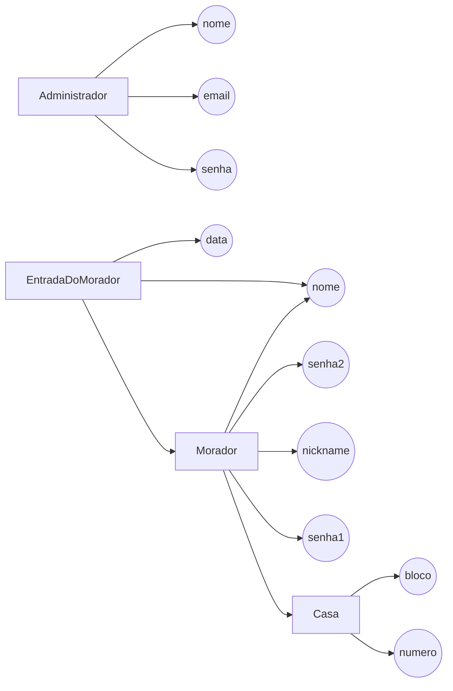

# CondSystem o sistema de segurança de portaria 

 

## **Etapas**

**Sprint 1** (24/05/2020)
* [x] Modelagem do banco de dados (12/05/2020)
* [x] API morador - (09/05/2020)
* [x] API Administração - (20/05/2020)
* [x] Tela da portaria - (18/05/2020)
* [x] Tela da admistração - (12/05/2020)

**Sprint 2** (14/06/2020)
* [x] integração Apis (8/06/2020)
* [x] integração da Aplicação (8/06/2020)

**Sprint 3** (21/06/2020)
* [x] implementação (notify messenger adm), painel do administrador, bloquear rotas e concerta o os front-end (12/06/2020);
* [x] Deploy da Aplicação (12/06/2020);
* [x] ordernar as mesagem de assalto ao adm no front end (12/06/2020);
* [ ] colocar mensagem em tempo real(websockt.io).

fluxograma do schema:

## **API**

### Available Scripts

No diretório do projeto, você pode executar:

* `yarn roda` ou `npm run roda`

Executa o aplicativo no modo de desenvolvimento. 
Abrir para visualizá-lo no navegador.

A página será recarregada se você fizer edições.  
Você também verá quaisquer erros no console.

* logar morador(portaria) [http://localhost:3000/](http://localhost:3000/)
* logar adminstrador [http://localhost:3000/adm/logar/](http://localhost:3000/funcionario/logar)
* criar morador (rota protegida) [http://localhost:3000/adm/criar/](http://localhost:3000/funcionario/criar)
* load do portao (rota protegida) [http://localhost:3000/up/](http://localhost:3000/up/)
* painel do adminstrador (rota protegida) [http://localhost:3000/adm/painel/](http://localhost:3000/adm/panel/)
* criar adminstrador (rota protegida) [http://localhost3000/adm/](http://localhost:3000/adm/)

#### features

- [x] controller do ADM.
- [x] tela de login do Adm.
- [x] tela de registrar moradores.
- [x] tela de autenticação do morador.
- [x] tela de load(portao).
- [x] painel da adminstração.
- [x] criptografia das senhas.
- [x] controlle do Morador.
- [x] autenticação senha 2.
- [x] bloquear a rota [http://localhost:3000/adm/criar/](http://localhost:3000//adm/criar/) de usuarios que não é adm;
- [x] bloquear a rota [http://localhost:3000/adm/painel/](http://localhost:3000/adm/painel/) de usuarios que não é adm;
- [x] bloquear a rota [http://localhost:3000/up/](http://localhost:3000/up/) simulador do portao abrindo;
- [x] retornar a mensagem nas requisiçoes (ex: conta criada com sucesso, conta ja existe, senha ou email incorretos);
- [x] conserta a rota do do login do usuario, está redirecionado para a tela de criar usuarios;
- [x] conserta controllers retornano uma tela não programada e apresentado menssage não interessante ao usuario;
- [x] responsividade na tela de login(adm);
- [x] responsividade na tela de login(moradores);
- [x] responsividade na tela de criar(moradores);
- [x] responsividade na tela de load(moradores);
- [x] responsividade no painel (adm);
- [x] criar um schema de log de entrada ao condominio (somente para quando usa a senha dois);
- [x] registrar a entrada do morador no schema;
- [x] retornar a mensagem de assalto ao painel do adminstrador pelo schema de logs de entrada;
- [x] ordernar as mesagem de assalto ao adm no front end (extra);
- [x] criar a tela de registrar adminstradores;
- [ ] colocar mensagem em tempo real(websockt.io)

### telas

##### tela do Morador (portaria)

##### tela da adminstração

###### Leonardo B. Bussi © - 2020 [licença MIT](https://raw.githubusercontent.com/leonardobussi/condsystem/master/LICENSE)
